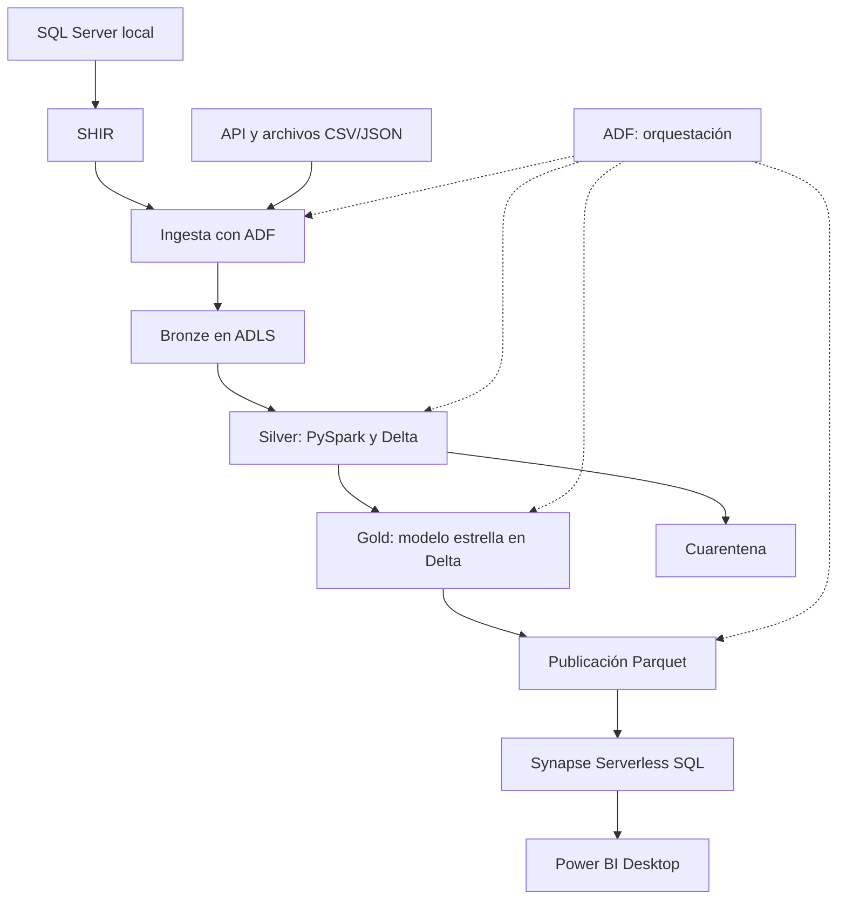

# Arquitectura inicial

## Visión general

La plataforma utilizará Azure Data Factory para la ingesta y la
orquestación, ADLS Gen2 para el almacenamiento y Azure Databricks
para las transformaciones con PySpark y Delta.

Las capas Bronze, Silver y Gold seguirán la arquitectura medallion.
La publicación para consumo utilizará archivos Parquet y vistas
en Synapse Serverless SQL. Power BI Desktop importará los resultados.

## Flujo y orquestación

Las flechas continuas representan el flujo de datos.
Las flechas discontinuas representan la coordinación de actividades.

## Fuentes e ingesta

### SQL Server local

La base TechRetail_OLTP proporcionará la carga inicial de clientes,
productos, pedidos y detalle de pedidos.

Un Self-hosted Integration Runtime (SHIR), instalado en Windows,
permitirá que ADF acceda a SQL Server sin exponerlo públicamente.

La extracción tendrá un corte temporal definido y controles de
reconciliación entre el origen y Bronze.

### API y archivos

- DummyJSON: catálogo ficticio complementario.
- BCRPData: tipo de cambio USD/PEN.
- CSV sintéticos: nuevos pedidos y detalles.
- JSON sintéticos: eventos de cambios.

Los contratos definirán campos, tipos, claves y reglas de validación.
El catálogo externo tendrá un mapeo explícito con los productos locales.

## Almacenamiento y transformación

| Capa | Contenido | Formato previsto |
|---|---|---|
| Bronze | Datos recibidos y metadatos de ingesta | JSON/CSV originales y Parquet para SQL Server |
| Silver | Datos limpios, deduplicados y cambios aplicados | Delta |
| Gold | Dimensiones, hechos y métricas comerciales | Delta |
| Cuarentena | Registros rechazados y motivo del rechazo | Parquet |
| Publicación | Resultados validados para consumo | Parquet |

Los datos persistentes del proyecto se almacenarán en ADLS Gen2.
Databricks ejecutará las transformaciones de Silver y Gold y
generará las exportaciones de publicación.

## Capa de orquestación

ADF coordinará:

1. La ingesta de cada fuente.
2. Los controles de integridad de la carga.
3. La ejecución de notebooks de Silver.
4. La ejecución de Gold cuando Silver supere los controles requeridos.
5. La publicación de resultados validados.

Las canalizaciones utilizarán parámetros, dependencias, reintentos
acotados y tiempos de espera.

Cada ejecución tendrá un identificador para relacionar actividades,
archivos procesados, resultados de calidad y errores.

Las primeras ejecuciones serán manuales. La programación automática
se incorporará después de validar el flujo y su costo.

## Incrementales e históricos

El CDC será simulado mediante eventos JSON; no se capturará el log
transaccional de SQL Server.

Se definirán identificadores de evento, claves de negocio,
ordenamiento y marcas de agua para procesar los cambios.

Las cargas deberán ser idempotentes. Las dimensiones seleccionadas
aplicarán SCD tipo 1 o tipo 2 según sus requisitos de negocio.

Delta permitirá trabajar con MERGE, versiones de tablas y time travel.
Las políticas de retención se definirán antes de eliminar históricos.

## Consumo analítico

Gold se exportará a Parquet después de superar las validaciones.

Synapse Serverless SQL expondrá vistas sobre estos archivos.
Esta publicación evitará depender de la compatibilidad directa entre
Synapse y las características de las tablas Delta utilizadas.

Power BI Desktop utilizará importación y actualización manual.
ADF no actualizará automáticamente el informe de Power BI.

## Seguridad

- Secretos de Azure en Key Vault.
- Identidades administradas donde la integración lo permita.
- Permisos mínimos para cada componente.
- Usuario de SQL Server con permisos de lectura para la extracción.
- Sin credenciales reales en Git.
- Sin acceso anónimo al almacenamiento.
- Datos comerciales sintéticos.

## Operación y costos

East US será la región candidata para los recursos de Azure.

Databricks se desplegará cuando el código y los datos de una ventana
de trabajo estén preparados. El cómputo se terminará al finalizar
cada sesión.

Antes de retirar infraestructura temporal se conservarán el código,
las configuraciones y los datos necesarios para reconstruirla.

El plan económico y los supuestos se documentarán en
../costs/budget-plan.md.

## Verificaciones pendientes antes del despliegue

- Elegibilidad y disponibilidad de Databricks en la suscripción.
- Cuotas y disponibilidad del nodo seleccionado.
- Discos y almacenamiento administrado creados por el servicio.
- Configuración de red y costos durante períodos sin cómputo.
- Alcance y costo de la monitorización.
- Procedimiento de retirada y reconstrucción del workspace.
